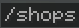
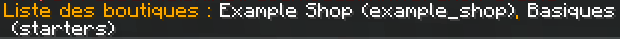
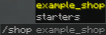
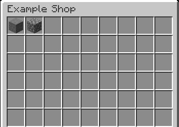
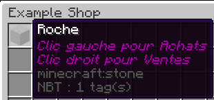
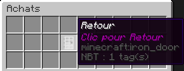
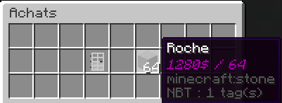
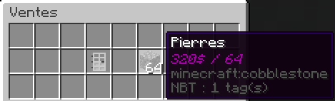

# OneaShops

### What is it ?

`OneaShops` is a simple and easy to use shop plugin for Minecraft. It allows you to create a variety of shops with configuration files.

# Table of Contents
- [Features](#Features)
- [Installation](#Installation)
- [Configuration](#Configuration)
- [Usage](#Usage)
- [Contact & Support](#Contact-/-Support)
- [Credits](#Credits)

# Features

Implemented :
- Command to lists shops *(based on your permissions)*
- Command autocompletion for shops
- Multiple shops with different configurations *(each shop use its own config file)*
- Up to 54 items by shop *(shops are limited to a double-chest standard size for the moment)*
- Each item can be sold, bought or both, with a setting for quantity and price
- Thresholds for each item buying or / and selling option *(for example, reduction of the price after 2 stacks sold)*
- Item lore that displays what can be sold, bought and pricings.
- Chat message that displays the result of the transaction.
- Customizable shop name *(and formatted name, used for the commands)*
- Per-shop permission support

To be added :
- Language system *(only available in French right now)*
- Multi-page shops *(no longer limited to 54 items)*
- Time-based thresholds *(reset after X days, hours, ...)*
- Custom items *(NBT support, other plugin items)*

# Installation

### Requirements

OneaShops requires the following setup to work :
- Compatible version of [Spigot](https://www.spigotmc.org) server (or forks like [Paper](https://papermc.io/downloads))
- [Vault](https://www.spigotmc.org/resources/vault.34315/) plugin

### Installing OneaShops

1 • Download the .jar file from ~~[Spigot](https://www.spigotmc.org)~~ the Releases tab and place it in the plugins folder of your server.  
2 • Restart the server once for the example shop file to appear.  
3 • Configure your shops as you wish.  
4 • Restart your server once again to make the changes take effect.

# Configuration

### Example shop
OneaShops provides an example file called `example.yml` for you to use as a starting point.  
This file is made available in the OneaShops folder in your server's plugins folder once you launched the server with the plugin installed.
Here is the content of this file :
    
```yml
shop:
  name: 'Example Shop'    # Name of the shop
  items:
  - id: 'minecraft:stone' # In-game Item ID
    buy:                  # Settings for buying (remove to disable buying completely)
      quantity: 64        # Base quantity for the item (stack size by default)
      base: 640           # Base price for the item
      thresholds:         # Thresholds (must be ordered!, remove to disable thresholds)
      - quantity: 128     # Max quantity for this threshold
        price: 1280       # Price of the item while in threshold
      - quantity: 128
        price: 960
    sell:                 # Settings for selling (same as buying)
      quantity: 64
      base: 320
      thresholds:
      - quantity: 192
        price: 640
      - quantity: 128
        price: 480
  - id: 'minecraft:cobblestone'
    sell:
      quantity: 64
      base: 320
```

### Custom shop

However, you can also create your own shop with your own configuration file.  
To do so, create a new YAML (`.yml`) file in the `shops` directory (inside the OneaShops folder) and name it as you wish. *(The name of the file is separated of the in-game shop name.)*  
The content of this file should be similar to the example file, but with the items, options and prices you want for your shop.
You might also want to choose a custom formatted name (used for the commands and permissions) for your shop. Here's how to do so :
    
```yml
shop:
  name: 'Example Shop'
  formattedname: 'formatted_name'
  items:
  - id: 'minecraft:cobblestone'
    sell:
      quantity: 64
      base: 320
```

The formatted name should be a valid chat argument format, and so, by default, is the shop name in lowercase, with spaces replaced by underscores. But the formatted name can be customized as you wish and isn't necessarily related to the shop name.

### Permissions

Access to shops is prevented by default, and a permission needs to be granted to the players to access the shop.  
The permission for each shop is based on its formatted name, presented as followed : `oneashops.<formattedname>`.  
For example, if a shop is called `Starting Items`, its default formatted name is `starting_items` and the permission for this shop is `oneashops.starting_items`.

# Usage

### Lists shops

You can lists the available shops by typing `/shops` in the chat :  


The command gives you the following result :  


### Access a specific shop

You can access a specific shop by typing `/shop <formattedname>` in the chat :  


This command provides autocompletion with the available shops depending on your permissions.

This opens the shop interface :  


### Buy / Sell an item

On the shop interface, buyable / sellable items have a specific lore that displays intructions on how to access the buying / selling interface :  


On the buying / selling interface, there is an iron door item on the left, that returns you to the shop interface :  


On the right is the item you clicked on and the quantity you are buying / selling. The lore of this item describes how much you will pay / receive and the quantity you are buying / selling :  


Theses screenshots were taken on a buying interface but the same applies to the selling interface :  


# Contact / Support
Any contact / support for this plugin is provided by Onea on its [Discord](https://discord.gg/sktqeRN5eS).  
You can also contact OniX, responsible of this project, in his Discord DMs @ OniX#5186.

# Credits
This Minecraft plugin is provided to you by :
-  [@NeoOniX](https://github.com/NeoOniX)
